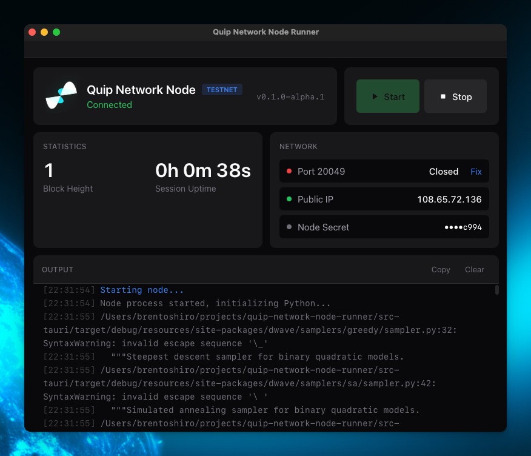

# Quip Network Testnet Node

Desktop application for running a Quip Network testnet node. Mine blocks, earn testnet participation credit, and help test the network.

<p align="center">
  
</p>

> **Alpha Software:** This is early testnet software. Expect bugs. Tokens have no monetary value.

## Download

| Platform | Download |
|----------|----------|
| macOS (Apple Silicon) | [Download .dmg](../../releases/latest) |
| Windows | [Download .exe](../../releases/latest) |
| Linux (Debian/Ubuntu) | [Download .deb](../../releases/latest) |
| Linux (Fedora/RHEL) | [Download .rpm](../../releases/latest) |
| Linux (AppImage) | [Download .AppImage](../../releases/latest) |

## Requirements

- **Port forwarding:** UDP port `20049` must be forwarded to your machine
- **macOS:** macOS 11 (Big Sur) or later
- **Windows:** Windows 10 or later
- **Linux:** Ubuntu 22.04 or equivalent

## Quick Start

1. Download and install the app
2. Launch "Quip Network Node"
3. Save your node secret somewhere safe (shown on first launch)
4. Click "Start" to begin mining

## Port Forwarding

The app needs incoming connections on UDP port 20049. To configure:

1. Log into your router (usually `192.168.1.1`)
2. Find Port Forwarding / NAT / Gaming settings
3. Add a rule: External `20049` → Internal `20049` (UDP)
4. Point it to your computer's local IP

## Building from Source

### Prerequisites

- [Node.js](https://nodejs.org/) 20+
- [Rust](https://rustup.rs/) 1.70+
- Platform-specific dependencies (see below)

### macOS

```bash
git clone https://github.com/rdyplayerB/quip-network-testnet-node.git
cd quip-network-testnet-node
npm install
npm run bundle-python
npm run tauri build
```

### Linux (Ubuntu/Debian)

```bash
sudo apt-get update
sudo apt-get install -y libwebkit2gtk-4.1-dev libappindicator3-dev librsvg2-dev

git clone https://github.com/rdyplayerB/quip-network-testnet-node.git
cd quip-network-testnet-node
npm install
npm run bundle-python
npm run tauri build
```

### Windows

Requires Visual Studio Build Tools with C++ workload.

```powershell
git clone https://github.com/rdyplayerB/quip-network-testnet-node.git
cd quip-network-testnet-node
npm install
npm run tauri build
```

## Development

```bash
npm run tauri dev
```

## License

MIT
